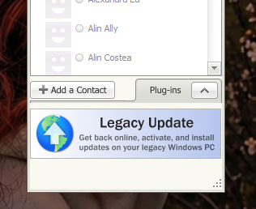

<div align="center">


<sub><i>⚠️ It is recommended to compile the application yourself, as it requires administrator privileges. I am not responsible for any serious issues or data loss. In the worst case, try it on a virtual machine before using it on your own system. Each release will include a VirusTotal report to avoid any uncertainty.</i></sub>

</div>

---

## [>>] About

This tool fixes the issue where **Yahoo! Web Search** does not appear in **Yahoo! Messenger** on modern versions of Windows, without requiring Compatibility Mode, by taking advantage of a Windows bug.

**(－_－) zzZ** — That's all this little tool does.

---

## [>>] Screenshots

| Before (Not Fixed) | After (Fixed) |
|:------------------:|:-------------:|
|  |  |
| *Web Search feature missing/broken* | *Web Search feature restored* |

---

## [>>] Supported Windows Versions

| Windows Version | Status |
|:----------------|:------:|
| Windows 10 22H2 | ✅ Tested & Working |
| Windows 11 Build 21996 | ✅ Tested & Working |
| Windows 11 21H2 | ✅ Tested & Working |
| Windows 11 22H2 | ✅ Tested & Working |
| Windows 11 23H2 | ✅ Tested & Working |
| Windows 11 24H2 | ✅ Tested & Working |
| Windows 11 25H2 | ✅ Tested & Working |
| Windows 11 26H2 | ⚠️ Not Tested |

---

## [>>] How to Run

### Option 1: Pre-compiled Executable

1. **Run as Administrator** (Right-click → *Run as Administrator*)
2. **Manual** When `YahooMessenger.exe` is not automatically detected
3. **Fix** to start fixing the Yahoo Messenger search bar
4. **Wait** for the fix to complete
5. **Exit** to close the window

[Remember| You might need to click "Fix" twice to fix Yahoo Messenger search.]<br>
(－_－) zzZ That's it. Launch Yahoo! Messenger and the Web Search should now be visible.

---

### Option 2: Compile from Source

**Prerequisites:** Go 1.21+, and a C compiler (MinGW-w64) since this uses CGO
for the webview UI. On Windows, the easiest option is
[w64devkit](https://github.com/skeeto/w64devkit/releases) — unzip it and add
its `bin` folder to your PATH.

```bash
# Clone the repository
git clone https://github.com/andreiixedev/YM-Search-Fixer.git
cd YM-Search-Fixer

# Download dependencies (go.mod is already included in the repo)
go mod tidy

# Build the executable (CGO is required for the webview UI)
$env:CGO_ENABLED = "1"
go build -ldflags="-H=windowsgui" -o YMFixer.exe .

# Run the compiled executable as Administrator
# (Right-click YMFixer.exe → Run as Administrator)
```

> **Note:** `-H=windowsgui` hides the background console window. If you want
> to see console output for debugging, drop that flag and just run
> `go build -o YMFixer.exe .`
